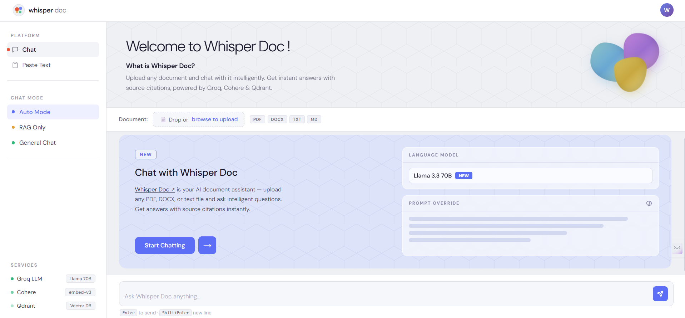

# RAG AI Chatbot

A powerful Retrieval-Augmented Generation (RAG) chatbot with a beautiful web interface. Upload documents (PDF, DOCX, TXT, MD) and chat with AI about their content, or use general chat mode for research and knowledge.


 

## Features

- 📄 **Multi-Format Support** - Upload PDF, DOCX, TXT, and Markdown files
- 🤖 **Dual Chat Modes** - RAG mode for documents, General mode for any topic
- 💬 **Intelligent Q&A** - Get answers with source citations from your documents
- 🎨 **Beautiful UI** - Modern, responsive web interface with gradient design
- 🆓 **100% Free APIs** - No credit card required, generous free tiers
- ⚡ **Fast Responses** - Powered by Groq's lightning-fast inference
- 🔍 **Smart Search** - Vector similarity search with Qdrant
- 📚 **Source Citations** - See which documents were used for each answer

## 🚀 Live Demo

**Try it now:** [(https://whisper-doc.onrender.com/)](https://whisper-doc.onrender.com/)

> Note: Free tier may take 50+ seconds to wake up after inactivity

### Example Usage

```
User: "What are the key features of Python?"
Bot: "Based on the uploaded document, Python's key features include:
     - Easy to learn and use
     - Extensive standard library
     - Cross-platform compatibility
     [RAG Mode - Used 2 document sources]"
```

## Technology Stack

| Component | Technology | Purpose |
|-----------|-----------|---------|
| **LLM** | Groq (Llama 3.3 70B) | Fast, intelligent responses |
| **Embeddings** | Cohere (embed-english-v3.0) | Document vectorization |
| **Vector DB** | Qdrant Cloud | Similarity search |
| **Backend** | Flask | Web server & API |
| **Document Parsing** | PyPDF2, python-docx | File processing |

## Quick Start

### Prerequisites

- Python 3.10 or higher
- Internet connection for API calls

### Installation

1. **Clone the repository**
```bash
git clone <your-repo-url>
cd rag-ai-chatbot
```

2. **Install dependencies**
```bash
pip install -r requirements.txt
```

3. **Get API Keys** (all free!)

#### Groq API Key
- Visit: https://console.groq.com/
- Sign up for a free account
- Navigate to API Keys section
- Create and copy your API key
- **Free Tier**: 14,400 requests/day

#### Cohere API Key
- Visit: https://dashboard.cohere.com/
- Sign up for a free account
- Go to API Keys section
- Copy your API key
- **Free Tier**: 100 calls/minute

#### Qdrant Cloud
- Visit: https://cloud.qdrant.io/
- Sign up for a free account
- Create a new cluster (Europe region recommended)
- Copy the cluster URL (format: `https://xxx.eu-west-2-0.aws.cloud.qdrant.io:6333`)
- Copy the API key from cluster settings
- **Free Tier**: 1GB storage

4. **Configure environment variables**

Create a `.env` file in the project root:

```env
# Groq API Key
GROQ_API_KEY=gsk_your_groq_api_key_here

# Cohere API Key
COHERE_API_KEY=your_cohere_api_key_here

# Qdrant Cloud Configuration
QDRANT_URL=https://your-cluster.eu-west-2-0.aws.cloud.qdrant.io:6333
QDRANT_API_KEY=your_qdrant_api_key_here
```

5. **Run the application**

```bash
python app.py
```

6. **Open your browser**

Navigate to: http://localhost:5000

## Usage Guide

### Web Interface

#### 1. Upload Documents

**Option A: File Upload**
- Click the upload area or drag & drop files
- Supported formats: PDF, DOCX, DOC, TXT, MD
- Max file size: 16MB
- Wait for "Ingested X chunks" confirmation

**Important:** Each new document upload replaces the previous one. This ensures clean, accurate responses without data mixing.

**Option B: Paste Text**
- Paste text directly into the text area
- Click "Ingest Document"

#### 2. Select Chat Mode

Choose from the dropdown:
- **Auto** - Tries RAG first, falls back to general if no documents
- **RAG Only** - Only searches uploaded documents
- **General Chat** - Direct LLM conversation without documents

#### 3. Ask Questions

**RAG Mode Examples:**
- "What is this document about?"
- "Summarize the main points"
- "What does it say about [topic]?"
- "Explain [specific concept] from the document"

**General Mode Examples:**
- "What is machine learning?"
- "Explain quantum computing"
- "How does photosynthesis work?"

### Command Line Interface

```bash
python rag_chatbot.py
```

**Commands:**
```bash
# Ingest text
/ingest Your document text here...

# Ask questions
What is the main topic?

# Exit
/quit
```

## Project Structure

```
rag-ai-chatbot/
├── app.py                  # Flask web server & API endpoints
├── rag_chatbot.py          # Core RAG logic & chatbot class
├── document_parser.py      # PDF/DOCX/TXT parsing utilities
├── requirements.txt        # Python dependencies
├── .env                    # API keys (create this, not in git)
├── .env.example           # Example environment variables
├── templates/
│   └── index.html         # Web interface UI
├── README.md              # This file
└── CLAUDE.md              # Development session history
```

## API Endpoints

### POST /api/ingest
Ingest a document into the knowledge base.

**Request (File Upload):**
```bash
curl -X POST http://localhost:5000/api/ingest \
  -F "file=@document.pdf"
```

**Request (Text):**
```json
{
  "text": "Your document text here",
  "metadata": {
    "source": "manual",
    "timestamp": "2026-03-18"
  }
}
```

**Response:**
```json
{
  "success": true,
  "chunks": 20,
  "message": "Ingested 20 chunks"
}
```

### POST /api/chat
Chat with the AI assistant.

**Request:**
```json
{
  "query": "What is Python?",
  "mode": "auto"
}
```

**Response:**
```json
{
  "answer": "Python is a high-level programming language...",
  "sources": [
    {
      "text": "Python is a high-level...",
      "score": 0.89,
      "metadata": {"source": "file_upload"}
    }
  ],
  "mode": "rag"
}
```

## Configuration

### Chunking Settings

Edit `rag_chatbot.py` to adjust chunking:

```python
chunks = self._chunk_text(text, chunk_size=1000, overlap=200)
```

- `chunk_size`: Characters per chunk (default: 1000)
- `overlap`: Overlapping characters between chunks (default: 200)

### Search Settings

Adjust number of retrieved documents:

```python
search_results = self.search(query, top_k=5)  # Change top_k value
```

### LLM Settings

Modify temperature and max tokens in `_call_groq()`:

```python
data = {
    "model": "llama-3.3-70b-versatile",
    "temperature": 0.7,  # 0.0 = deterministic, 1.0 = creative
    "max_tokens": 2000   # Maximum response length
}
```

## API Rate Limits

| Service | Free Tier Limits |
|---------|-----------------|
| **Groq** | 14,400 requests/day, 30 requests/minute |
| **Cohere** | 100 API calls/minute |
| **Qdrant** | 1GB storage, unlimited requests |

## Troubleshooting

### Issue: "charmap codec can't encode character"
**Solution**: Fixed in latest version. All Unicode characters replaced with ASCII-safe alternatives.

### Issue: "400 Bad Request" from Groq
**Solution**: Model updated to `llama-3.3-70b-versatile`. Ensure you're using the latest code.

### Issue: "Collection not found"
**Solution**: Collection is created automatically on first run. Restart the application.

### Issue: "Unauthorized" error
**Solution**:
- Check API keys in `.env` file
- Ensure no extra spaces or quotes around keys
- Verify keys are valid on respective dashboards

### Issue: Slow responses
**Possible causes:**
- Internet connection issues
- Qdrant cluster region (Europe has ~100-150ms latency from Asia)
- Large documents (try smaller chunks)

### Issue: PDF parsing fails
**Solution**:
- Ensure PDF is not password-protected
- Some scanned PDFs may not have extractable text
- Try converting to text first

## Development

### Running Tests

```bash
# Test document parser
python -c "from document_parser import parse_document; print(parse_document('test.txt'))"

# Test RAG chatbot
python rag_chatbot.py
```

### Adding New File Formats

Edit `document_parser.py` and add parsing logic:

```python
def parse_new_format(file_path: str) -> str:
    # Your parsing logic here
    return extracted_text
```

## Deployment

### Deploy to Render (Recommended)

This project is deployed on Render. To deploy your own instance:

1. **Fork this repository** on GitHub

2. **Sign up for Render** at https://render.com

3. **Create a new Web Service**
   - Connect your GitHub account
   - Select your forked repository
   - Render will auto-detect settings from `render.yaml`

4. **Add Environment Variables** in Render dashboard:
   ```
   GROQ_API_KEY=your_groq_api_key
   COHERE_API_KEY=your_cohere_api_key
   QDRANT_URL=https://your-cluster.qdrant.io:6333
   QDRANT_API_KEY=your_qdrant_api_key
   ```

5. **Deploy** - Render will automatically build and deploy your app

**Important Notes:**
- Free tier spins down after inactivity (50s wake-up time)
- First deployment takes 3-5 minutes
- Auto-deploys on every git push to main branch

### Deploy to Railway

1. Create `railway.json`:
```json
{
  "build": {
    "builder": "NIXPACKS"
  },
  "deploy": {
    "startCommand": "python app.py"
  }
}
```

2. Add environment variables in Railway dashboard
3. Deploy from GitHub

### Deploy to Heroku

1. Create `Procfile`:
```
web: python app.py
```

2. Create `runtime.txt`:
```
python-3.10.0
```

3. Deploy:
```bash
heroku create your-app-name
git push heroku main
```

## Roadmap

- [ ] Add conversation history/memory
- [ ] Support for more file formats (CSV, JSON, XML)
- [ ] Multi-language support
- [ ] User authentication
- [ ] Document management (list, delete documents)
- [ ] Export chat history
- [ ] Dark mode toggle
- [ ] Mobile app

## Contributing

Contributions are welcome! Please feel free to submit a Pull Request.

1. Fork the repository
2. Create your feature branch (`git checkout -b feature/AmazingFeature`)
3. Commit your changes (`git commit -m 'Add some AmazingFeature'`)
4. Push to the branch (`git push origin feature/AmazingFeature`)
5. Open a Pull Request

## License

This project is licensed under the MIT License - see below for details:

```
MIT License

Copyright (c) 2026

Permission is hereby granted, free of charge, to any person obtaining a copy
of this software and associated documentation files (the "Software"), to deal
in the Software without restriction, including without limitation the rights
to use, copy, modify, merge, publish, distribute, sublicense, and/or sell
copies of the Software, and to permit persons to whom the Software is
furnished to do so, subject to the following conditions:

The above copyright notice and this permission notice shall be included in all
copies or substantial portions of the Software.

THE SOFTWARE IS PROVIDED "AS IS", WITHOUT WARRANTY OF ANY KIND, EXPRESS OR
IMPLIED, INCLUDING BUT NOT LIMITED TO THE WARRANTIES OF MERCHANTABILITY,
FITNESS FOR A PARTICULAR PURPOSE AND NONINFRINGEMENT. IN NO EVENT SHALL THE
AUTHORS OR COPYRIGHT HOLDERS BE LIABLE FOR ANY CLAIM, DAMAGES OR OTHER
LIABILITY, WHETHER IN AN ACTION OF CONTRACT, TORT OR OTHERWISE, ARISING FROM,
OUT OF OR IN CONNECTION WITH THE SOFTWARE OR THE USE OR OTHER DEALINGS IN THE
SOFTWARE.
```

## Acknowledgments

- [Groq](https://groq.com/) - Lightning-fast LLM inference
- [Cohere](https://cohere.com/) - Powerful embedding models
- [Qdrant](https://qdrant.tech/) - High-performance vector database
- [Flask](https://flask.palletsprojects.com/) - Lightweight web framework

## Support

If you encounter any issues or have questions:

1. Check the [Troubleshooting](#troubleshooting) section
2. Review [CLAUDE.md](CLAUDE.md) for development history
3. Open an issue on GitHub

## Star History

If you find this project useful, please consider giving it a ⭐ on GitHub!

---

**Built with ❤️ using Claude Code**
